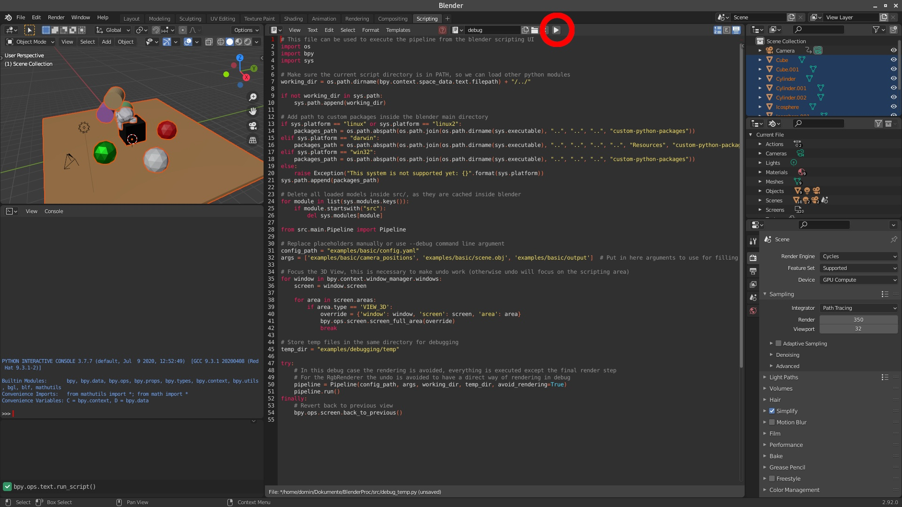

# satellite_BlenderProc

A procedural Blender pipeline for photorealistic rendering of satellites. This project is based on BlenderProc2.


## Features

* Loading: `*.obj`, `*.ply`, `*.blend`, etc.
* Objects: Set or sample object poses, apply physics and collision checking.
* Materials: Set or sample physically-based materials and textures
* Lighting: Set or sample lights, automatic lighting of 3D-FRONT scenes.
* Cameras: Set, sample or load camera poses from file.
* Rendering: RGB, depth images/sequences.
* Writing: BOP annotations.


## Installation

### Git clone

If you need to make changes to blenderproc or you want to make use of the most recent version on the main-branch, clone the repository:

```bash
git clone https://github.com/lyltc1/satellite_BlenderProc
```

To still make use of the blenderproc command and therefore use blenderproc anywhere on your system, make a local pip installation:

```bash
cd satellite_BlenderProc
pip install -e .
```

## Usage

BlenderProc has to be run inside the blender python environment, as only there we can access the blender API. 
Therefore, instead of running your script with the usual python interpreter, the command line interface of BlenderProc has to be used.

```bash
blenderproc run <your_python_script>
```


### Debugging in the Blender GUI

To understand what is actually going on, BlenderProc has the great feature of visualizing everything inside the blender UI.
To do so, simply call your script with the `debug` instead of `run` subcommand:
```bash
blenderproc debug quickstart.py
```

Now the Blender UI opens up, the scripting tab is selected and the correct script is loaded.
To start the BlenderProc pipeline, one now just has to press `Run BlenderProc` (see red circle in image).
As in the normal mode, print statements are still printed to the terminal.

<p align="center">

</p>

The pipeline can be run multiple times, as in the beginning of each run the scene is cleared.

### Breakpoint-Debugging in IDEs

As blenderproc runs in blenders separate python environment, debugging your blenderproc script cannot be done in the same way as with any other python script.
Therefore, remote debugging is necessary, which is explained for vscode and PyCharm in the following:

#### Debugging with vscode

First, install the `debugpy` package in blenders python environment.

```
blenderproc pip install debugpy
```

Now add the following configuration to your vscode [launch.json](https://code.visualstudio.com/docs/python/debugging#_initialize-configurations).

```json
{                        
    "name": "Attach",
    "type": "python",
    "request": "attach",
    "connect": {
        "host": "localhost",
        "port": 5678
    }
}
```

Finally, add the following lines to the top (after the imports) of your blenderproc script which you want to debug.

```python
import debugpy
debugpy.listen(5678)
debugpy.wait_for_client()
```

Now run your blenderproc script as usual via the CLI and then start the added "Attach" configuration in vscode.
You are now able to add breakpoints and go through the execution step by step.
